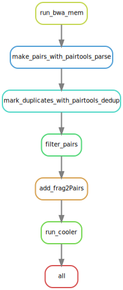

# Process_HiC_SnakeMake
 
## Table of contents:
* [Description of individual steps in pipeline](https://github.com/SansamLab/Process_HiC_SnakeMake/edit/main/README.md#description-of-individual-steps-in-pipeline)
  * [1.  run_bwa_mem](https://github.com/SansamLab/Process_HiC_SnakeMake/blob/main/README.md#1--run_bwa_mem)
  * [2.  make_pairs_with_pairtools_parse](https://github.com/SansamLab/Process_HiC_SnakeMake/blob/main/README.md#2--make_pairs_with_pairtools_parse)
  * [3.  mark_duplicates_with_pairtools_dedup](https://github.com/SansamLab/Process_HiC_SnakeMake/blob/main/README.md#3--mark_duplicates_with_pairtools_dedup)
  * [4.  filter_pairs](https://github.com/SansamLab/Process_HiC_SnakeMake/blob/main/README.md#4--filter_pairs)
  * [5.  add_frag2Pairs](https://github.com/SansamLab/Process_HiC_SnakeMake/blob/main/README.md#5--add_frag2pairs)
  * [6.  run_cooler](https://github.com/SansamLab/Process_HiC_SnakeMake/blob/main/README.md#6--run_cooler)
* [Step-by-step instructions on running Snakemake pipeline:](https://github.com/SansamLab/Process_HiC_SnakeMake/blob/main/README.md#step-by-step-instructions-on-running-snakemake-pipeline)
  * [1.  Load slurm and miniconda](https://github.com/SansamLab/Process_HiC_SnakeMake/blob/main/README.md#1--load-slurm-and-miniconda)
  * [2.  Start the conda environment](https://github.com/SansamLab/Process_HiC_SnakeMake/blob/main/README.md#2--start-the-conda-environment)
    * [2A.  FIRST TIME ONLY:  Setup conda environment](https://github.com/SansamLab/Process_HiC_SnakeMake/blob/main/README.md#2a--first-time-only--setup-conda-environment)
    * [2B.  Activate conda environment](https://github.com/SansamLab/Process_HiC_SnakeMake/blob/main/README.md#2b--activate-conda-environment)
  * [3.  Modify the job-specific coniguration files.](https://github.com/SansamLab/Process_HiC_SnakeMake/blob/main/README.md#3--modify-the-job-specific-coniguration-files)
    * [3A.  Modify the config/config.yml file](https://github.com/SansamLab/Process_HiC_SnakeMake/blob/main/README.md#3a--modify-the-configconfigyml-file)
    * [3B.  Modify the config/samples.csv file](https://github.com/SansamLab/Process_HiC_SnakeMake/blob/main/README.md#3b--modify-the-configsamplescsv-file)
    * [3C.  IF SLURM RESOURCE CHANGES ARE NEEDED. Modify the config/cluster_config.yml file](https://github.com/SansamLab/Process_HiC_SnakeMake/blob/main/README.md#3c--if-slurm-resource-changes-are-needed-modify-the-configcluster_configyml-file)
  * [4.  Do a dry run](https://github.com/SansamLab/Process_HiC_SnakeMake/blob/main/README.md#4--do-a-dry-run)
  * [5.  Make a DAG diagram](https://github.com/SansamLab/Process_HiC_SnakeMake/blob/main/README.md#5--make-a-dag-diagram)
  * [6.  Run on cluster with slurm](https://github.com/SansamLab/Process_HiC_SnakeMake/blob/main/README.md#6--run-on-cluster-with-slurm)

## Description of individual steps in pipeline:


### 1.  run_bwa_mem
### 2.  make_pairs_with_pairtools_parse
### 3.  mark_duplicates_with_pairtools_dedup
### 4.  filter_pairs
### 5.  add_frag2Pairs
### 6.  run_cooler

## Step-by-step instructions on running Snakemake pipeline:

### 1.  Load slurm and miniconda
Note. The commands to do this will be different on your machine. These commands are specific to an HPC using slurm with these modules installed.

```bash
ml slurm
ml miniconda
```

### 2.  Start the conda environment
### 2A.  FIRST TIME ONLY:  Setup conda environment
```bash
# -f is the location of the environment .yml file. 
## The relative path assumes that you are in the root directory of this repository.
# -p is the path where you want to install this environment
conda env create -f workflow/envs/HiCSnakemake.yml -p /s/sansam-lab/HiC_Conda_Environment 
```

### 2B.  Activate conda environment
```bash
conda activate -p /s/sansam-lab/HiC_Conda_Environment
```

### 3.  Modify the job-specific coniguration files.
#### 3A.  Modify the config/config.yml file

#### 3B.  Modify the config/samples.csv file

#### 3C.  IF SLURM RESOURCE CHANGES ARE NEEDED. Modify the config/cluster_config.yml file


### 4.  Do a dry run.
```bash
snakemake -npr
```

### 5.  Make a DAG diagram.
```bash
snakemake --dag | dot -Tpdf > dag.pdf
```

### 6.  Run on cluster with slurm.
```bash
sbatch --wrap="\
snakemake \
-R \
-j 999 \
--cluster-config config/cluster_config.yml \
--cluster '\
sbatch \
-A {cluster.account} \
-p {cluster.partition} \
--cpus-per-task {cluster.cpus-per-task}  \
-t {cluster.time} \
--mem {cluster.mem} \
--output {cluster.output}'"
```

### 7.  When finished, exit environment.
```bash
conda deactivate
```
